# 🏠 Madrid Airbnb — EDA & Price Prediction

🇬🇧 [English](#english) · 🇪🇸 [Español](#español)

---

<a name="english"></a>
## 🇬🇧 English

### Objective

To analyze the short-term rentals market in Madrid by using Airbnb listing data. It includes geographic distribution, price distribution, types of accommodation, and neighborhood density. In the second phase, a Machine Learning approach is adopted to predict the price of the listings based on the features of the listings.

### Dataset

- **Source:** [Kaggle — Madrid Airbnb Data](https://www.kaggle.com/datasets/rusiano/madrid-airbnb-data)
- **Original Source:** Inside Airbnb
- **Number of Listings:** ~19,600
- **Features:** 16 columns of data including price, location, room type, reviews, availability, etc.

### Tools & Technologies

| Area | Tools |
|------|-------|
| EDA | Python, pandas, matplotlib, seaborn |
| Machine Learning | scikit-learn (Linear Regression, Random Forest, Gradient Boosting) |
| SQL | Snowflake — Analytical Queries on the Dataset |
| Visualization | Tableau Public (Interactive Dashboard) |
| Environment | Google Colab |

### Project Structure

```
01-madrid-airbnb/
├── 01_madrid_airbnb_eda_ml.ipynb    # Main notebook (EDA + ML)
├── queries.sql                      # SQL queries (Snowflake)
├── images/                          # Generated plots
│   ├── 01_analisis_univariante.png
│   ├── 02_analisis_bivariante.png
│   ├── 03_mapa_geografico.png
│   ├── 04_correlaciones.png
│   ├── 05_modelo_resultados.png
│   ├── 06_residuos.png
│   ├── query_1.png
│   ├── query_2.png
│   ├── query_3.png
│   ├── query_4.png
│   └── query_5.png
└── README.md
```

### Key Findings

#### EDA

Median price is approximately 50€ per night. However, the data is heavily skewed to the right. Most of the listings are affordable, while a few are luxury listings. Entire home/apt is the dominant type of accommodation (~11,300 listings), followed by Private room (~7,800). Most of the listings are concentrated in the neighborhoods of Embajadores, Universidad, and Palacio. There is a cluster of listings where the minimum stay is 30 nights, indicating the presence of long-term rentals.

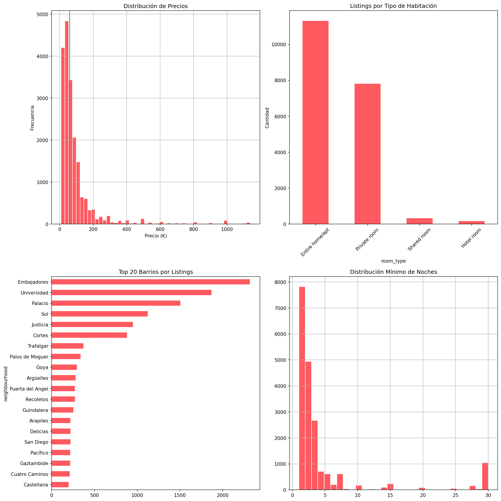

Price distribution by room type and top 20 most expensive neighborhoods (median, min. 50 listings):

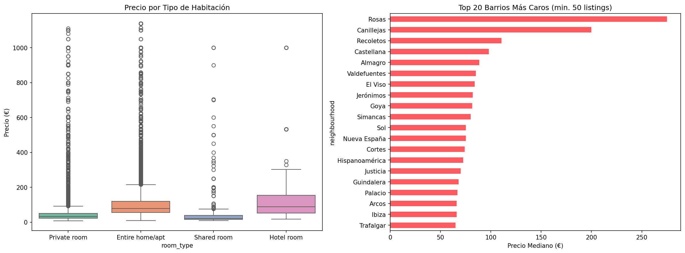

Geographic distribution of listings in Madrid, colored by price:

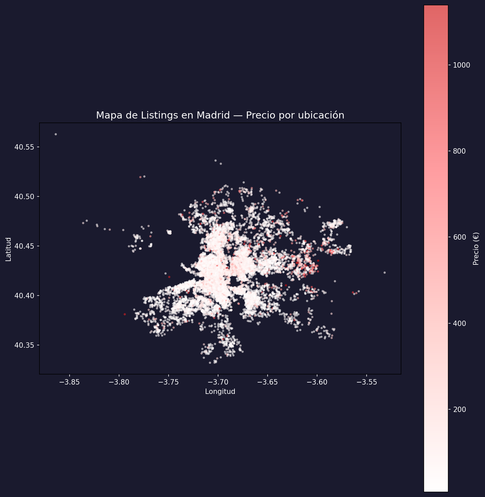

#### Correlations

Numerical values show very low correlation with price (all values below 0.04), reinforcing that price is highly influenced by categorical attributes such as room type and neighborhood.

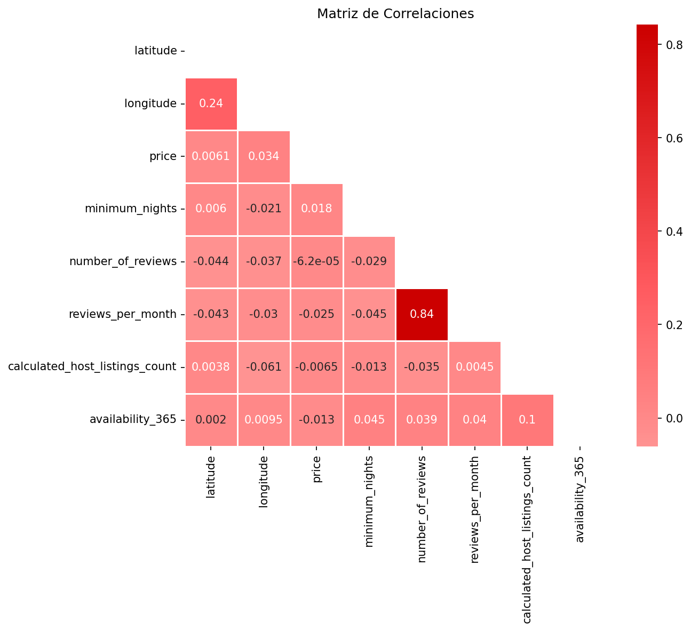

#### Machine Learning

Random Forest provided the best results: R² = 0.35, MAE = 53€. Location and host listing count were found to be the most important features. Linear Regression performed poorly (R² = 0.07), as expected from the non-linear relationship between price and attributes. R² = 0.35 is a reasonable value for this data set, as price is influenced by factors not included in this data set (photos, amenities, quality of text, etc.).

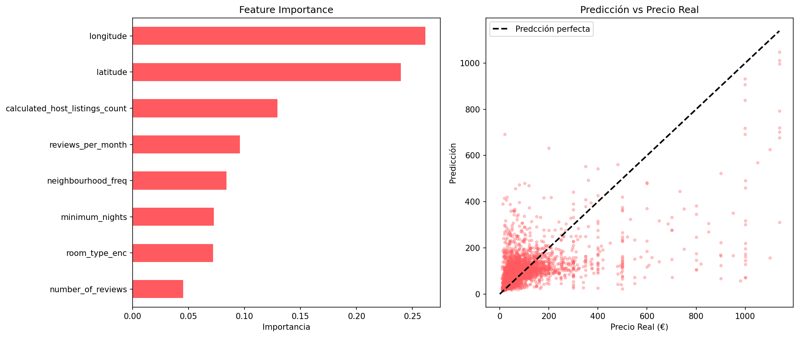

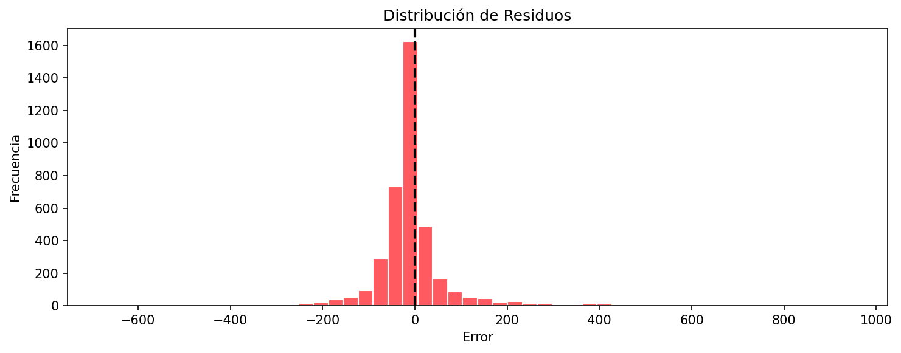

#### SQL (Snowflake)

Five analytical queries were made on this data set:

**Query 1 — Top 20 neighborhoods by listing count:**

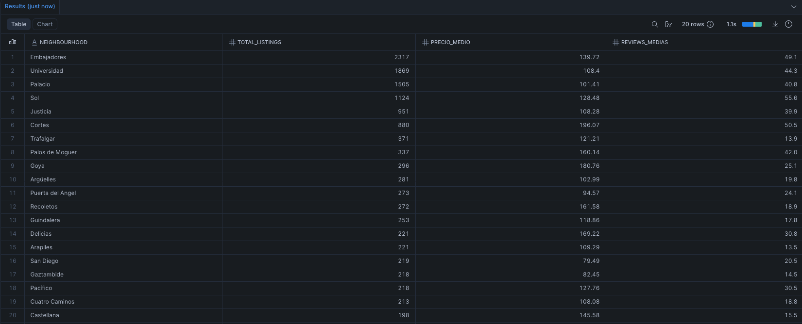

**Query 2 — Statistics on price by room type:**

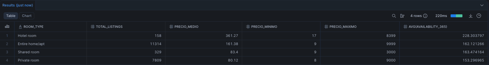

**Query 3 — Professional hosts with 10+ listings:**

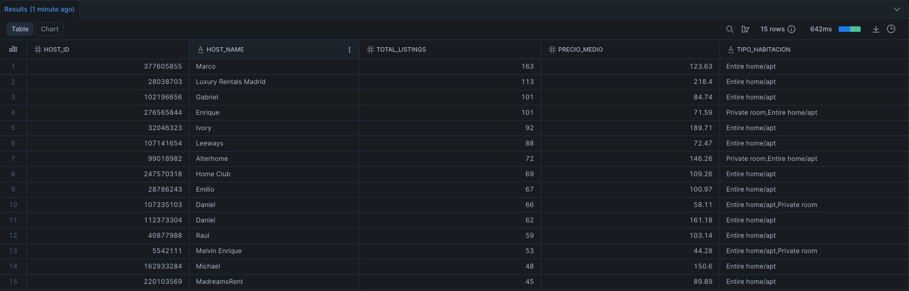

**Query 4 — Most expensive vs. cheapest neighborhoods:**

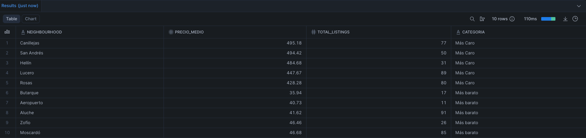

**Query 5 — Metrics by price range:**

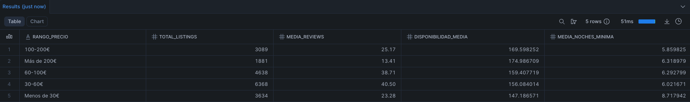

#### Tableau Dashboard

An interactive dashboard was created with price map, top 20 neighborhoods, room type distribution, reviews vs price, and global filters by room type, price range, and district.

📊 [View the dashboard on Tableau Public](https://public.tableau.com/app/profile/alberto.llaneza.tabares/viz/Airbnb-Madrid/MadridAirbnbMarketAnalysis2021)

### Lessons Learned

- **Data leakage:** Calculating aggregated values (e.g., median price per neighborhood) before splitting data into train and test sets will inflate R² values artificially. It is important to split data first and then calculate new values using only the training set.
- **LabelEncoder pitfalls:** Using LabelEncoder on incorrect columns will corrupt the pipeline and require a full runtime restart.
- **Variable naming in loops:** Using the dictionary name as a loop variable will cause it to be overwritten by the dictionary itself. It is important to use a different name for this variable.
- **Outlier impact on aggregations:** Peripheral neighborhoods with few luxury listings can have a high impact on "Top N" aggregations when using the mean. The median is a better option for this type of analysis.

### How to Reproduce

1. Download the dataset from [Kaggle](https://www.kaggle.com/datasets/rusiano/madrid-airbnb-data)
2. Open the notebook in [Google Colab](https://colab.research.google.com/)
3. Run all cells sequentially
4. For SQL: create a free Snowflake trial account and load the CSV into a `listings` table
5. For Tableau: connect the exported CSV to Tableau Public

---

<a name="español"></a>
## 🇪🇸 Español

### Objetivo

Analizar el mercado de alquiler turístico en Madrid mediante los datos de listings de Airbnb. Según un objetivo secundario, se deberá realizar un modelo de Machine Learning que permita predecir el precio de un listing en función de sus característcas.

### Dataset

- **Fuente:** [Kaggle — Madrid Airbnb Data](https://www.kaggle.com/datasets/rusiano/madrid-airbnb-data)
- **Origen:** Inside Airbnb
- **Registros:** ~19.600 listings
- **Variables:** 16 columnas, incluyendo precio, ubicación, tipo de habitación, reviews, disponibilidad, información sobre el host, etc.

### Herramientas y Tecnologías

| Área | Herramientas |
|------|-------------|
| EDA | Python, pandas, matplotlib, seaborn |
| Machine Learning | scikit-learn (Regresión Lineal, Random Forest, Gradient Boosting) |
| SQL | Snowflake — consultas analíticas sobre los datos |
| Visualización | Tableau Public — dashboard interactivo |
| Entorno | Google Colab |

### Estructura del Proyecto

```
01-madrid-airbnb/
├── 01_madrid_airbnb_eda_ml.ipynb    # Notebook principal (EDA + ML)
├── queries.sql                      # Queries SQL (Snowflake)
├── images/                          # Gráficos generados
│   ├── 01_analisis_univariante.png
│   ├── 02_analisis_bivariante.png
│   ├── 03_mapa_geografico.png
│   ├── 04_correlaciones.png
│   ├── 05_modelo_resultados.png
│   ├── 06_residuos.png
│   ├── query_1.png
│   ├── query_2.png
│   ├── query_3.png
│   ├── query_4.png
│   └── query_5.png
└── README.md
```

### Hallazgos Principales

#### EDA

El precio mediano es de unos 50€/noche, con fuerte asimetría a la derecha, es decir, la mayoría son asequibles con algunos listings de lujo. Entire home/apt es la opción más popular (~11.300 listings), seguida de Private room (~7.800). Las opciones de habitaciones compartidas y de hotel son marginal. Los barrios con más listings son Embajadores, Universidad y Palacio, todos centros céntricos con alta actividad turística. También destaca la existencia de listings con estancias mínimas de 30 noches, lo que sugiere la existencia de alquileres a largo plazo.


Distribución de precio por tipo de habitación y top 20 barrios más caros (mediana, min. 50 listings):


Distribución geográfica de los listings en Madrid, coloreados por precio:


#### Correlaciones

Las características numéricas muestran muy baja correlación con el precio (todas menores a 0.04), lo que ratifica que el precio depende principalmente de características categóricas como tipo de habitación y barrio.


#### Machine Learning

Random Forest ha mostrado las mejores prestaciones: R² = 0.35 y MAE = 53€. Las features más importantes son la ubicación (latitud/longitud) y número de listings del host, seguidas de reviews por mes y barrio. La Regresión Lineal ha mostrado unas prestaciones bajas (R² = 0.07), lo que ratifica la no linealidad de la relación con el precio. Un R² = 0.35 es realista ya que depende del precio de muchos factores no disponibles en nuestros datos: fotos, amenities, calidad de la descripción, estacionalidad.


#### SQL (Snowflake)

Se han realizado cinco queries con propósitos analíticos:

**Query 1 — Top 20 barrios por número de listings:**


**Query 2 — Estadísticas de precio por tipo de habitación:**


**Query 3 — Hosts profesionales con 10+ propiedades:**


**Query 4 — Barrios más caros vs más baratos:**


**Query 5 — Métricas por rango de precio:**


#### Dashboard en Tableau

Se ha realizado un dashboard interactivo con mapa de precios, top 20 barrios, distribución por tipo de habitación, reviews vs precio, y filtros globales por tipo de habitación, rango de precio y distrito.

📊 [Ver el dashboard en Tableau Public](https://public.tableau.com/app/profile/alberto.llaneza.tabares/viz/Airbnb-Madrid/MadridAirbnbMarketAnalysis2021)

### Lecciones Aprendidas

- **Data leakage:** Calcular features agregadas (como la mediana del precio por barrio) antes del split train/test lleva a una inflación artificial del R². Siempre es recomendable separar los datos en entrenamiento y prueba primero y luego crear features con los datos solo del entrenamiento.
- **LabelEncoder:** Aplicar el LabelEncoder a la columna equivocada lleva a la corrosión silenciosa del pipeline. Se tendrá que reiniciar el runtime completo.
- **Nombres de variables en bucles:** Utilizar el nombre del diccionario como variable del bucle lleva a la sobreescripción del propio diccionario. Se debe utilizar un nombre distinto.
- **Impacto de los outliers en la agregación:** Los barrios periféricos con pocas listings de lujo pueden tener un impacto muy grande en los "Top N" con la media. La mediana es más adecuada para este tipo de análisis.

### Cómo Reproducir

1. Descargar el conjunto de datos desde [Kaggle](https://www.kaggle.com/datasets/rusiano/madrid-airbnb-data)
2. Abrir el notebook en [Google Colab](https://colab.research.google.com/)
3. Ejecutar todas las celdas en orden
4. Para SQL: crear una cuenta gratuita de prueba en Snowflake y cargar el CSV en una tabla `listings`
5. Para Tableau: conectar el CSV exportado a Tableau Public
